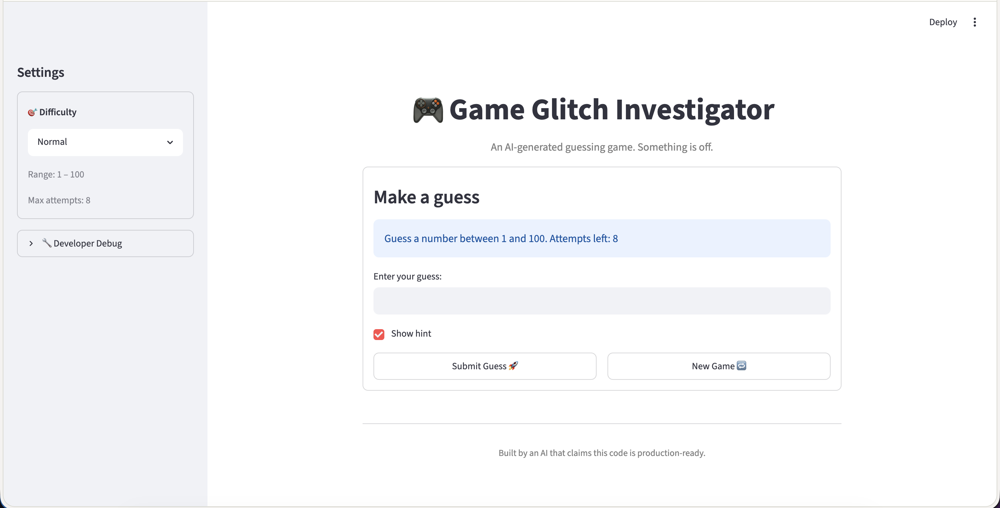

# 🎮 Game Glitch Investigator: The Impossible Guesser

## 🚨 The Situation

You asked an AI to build a simple "Number Guessing Game" using Streamlit.
It wrote the code, ran away, and now the game is unplayable.

- You can't win.
- The hints lie to you.
- The secret number seems to have commitment issues.

## 🛠️ Setup

1. Install dependencies: `pip install -r requirements.txt`
2. Run the broken app: `python -m streamlit run app.py`

## 🕵️‍♂️ Your Mission

1. **Play the game.** Open the "Developer Debug Info" tab in the app to see the secret number. Try to win.
2. **Find the State Bug.** Why does the secret number change every time you click "Submit"? Ask ChatGPT: _"How do I keep a variable from resetting in Streamlit when I click a button?"_

3. **Fix the Logic.** The hints ("Higher/Lower") are wrong. Fix them.
4. **Refactor & Test.** - Move the logic into `logic_utils.py`.
   - Run `pytest` in your terminal.
   - Keep fixing until all tests pass!

## 📝 Document Your Experience

- [x] Describe the game's purpose.
  - The purpose of this game is to guess a secret number between 1 & 100, within a maximum of 8 attempts.
- [x] Detail which bugs you found.
  - The higher/lower hints were incorrect, causing the user to guess in the wrong direction. Changing the difficulty did not reset the game state under the expected conditions. On even attempt numbers, the secret was cast to a string, breaking the integer comparison in check_guess().

- [x] Explain what fixes you applied.
  - I swapped the return values in check_guess() so that the hints would be correct. I also fixed the game state to persist across reruns. Finally, I moved the logic into a separate file to make it more organized.

## 📸 Demo Walkthrough

Describe your fixed game in numbered steps so a reader can follow along without watching a video:

1. Player selects a difficulty (Easy: 1-20, Normal: 1-100, Hard: 1-50).
2. Player types a number and clicks Submit. Attempt counter goes up.
3. check_guess() in logic_utils.py returns the correct "Too High" / "Too Low" / "Win" outcome.
4. Hints display correctly: guess above secret → "Go LOWER!", guess below → "Go HIGHER!".
5. Clicking New Game resets everything: secret, attempts, score, history, status.
6. Game ends on correct guess (balloons) or running out of attempts (error message).

## 🧪 Test Results

```
=================================================================== test session starts ====================================================================
platform darwin -- Python 3.14.3, pytest-9.1.1, pluggy-1.6.0
rootdir: /Users/agentv/Projects/studysessions/AI110/gameglitch
plugins: anyio-4.14.0
collected 4 items

tests/test_game_logic.py ....                                                                                                                        [100%]

==================================================================== 4 passed in 0.01s =====================================================================
```

## 🚀 Stretch Features

- The game body was given a rounded container with card-style borders. The developer debug tool was moved out of the main game view and hidden inside a collapsed expander in the Settings sidebar.
- The Show Hint toggle was repositioned above the action buttons to make the game layout more uniform and compact.
- General text elements were updated to use semantic HTML tags (`<h1>`, `<p>`, `<small>`) matching their role on the page.
- Finally, the main title was centered to match the rest of the header area.


